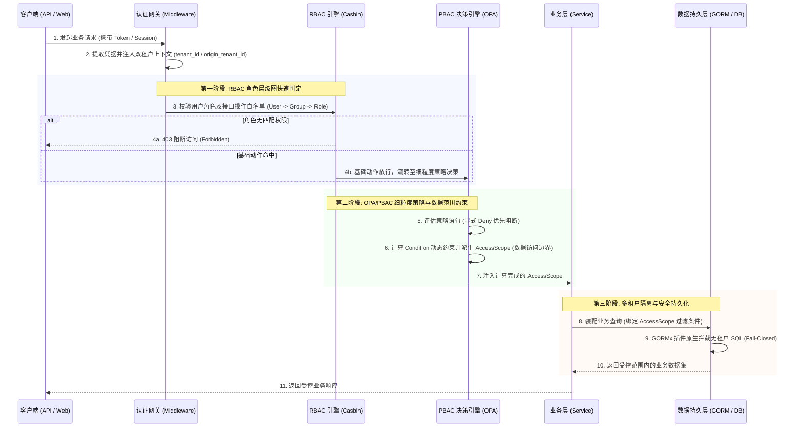

# EIAM - 企业级多租户身份治理与访问控制平台

EIAM 是面向微服务架构的企业级多租户统一身份与访问控制平台。系统基于 Casbin 与 OPA 双引擎架构构建，提供用户生命周期管理、多组织租户隔离、现代认证凭据以及基于属性的数据范围（PBAC）决策能力。

## 核心能力

### 多租户与组织管理
- 多租户强隔离：数据层原生拦截与上下文透传，支持租户安全切换与租户成员管理。
- 组织架构：支持无限级部门树、部门成员分配以及用户组角色继承。

### 现代认证体系
- 无密码登录：基于 WebAuthn 标准支持 Passkey 凭据注册与登录。
- 二次验证：内置基于时间的动态口令（TOTP MFA）多因素认证。
- 外部身份源：支持企业级 LDAP 用户检索与同步，以及标准 OIDC（含企业飞书）单点登录。

### 权限与数据范围决策
- RBAC 角色授权：基于 Casbin 维护用户、用户组与角色的继承图关系。
- PBAC 数据范围：集成 OPA，结合请求上下文与环境属性动态计算数据访问范围（AccessScope）。

### 资产自发现与契约工具链
- 权限资产治理：服务启动时自动扫描并同步本地受控权限资产。
- OpenAPI 3.0 文档：内置静态提取引擎，零注释导出 Swagger 规范并生成内嵌三栏式交互预览页面。
- 强类型契约代码：自动生成全系统权限点与领域模型常量，提供编译期类型检查。

## 鉴权架构与流转时序

EIAM 采用 Casbin 与 OPA 双引擎分层防御架构，贯穿“身份认证 -> 角色判决 -> 策略计算 -> 数据隔离”的全链路交互流转如下：



## 目录结构

```text
├── api                    # 协议契约：gRPC Proto 定义与 OpenAPI 3.0 文档
├── cmd                    # CLI 工具入口：server (主服务)、migrate (迁移)、permgen/swaggergen
├── config                 # 配置文件样例
├── docs                   # 系统架构指南、PBAC 数据范围说明与权限大盘字典
├── internal
│   ├── authz              # OPA / Rego 策略决策实现
│   ├── domain             # 业务领域实体定义
│   ├── grpc               # gRPC 远程服务实现
│   ├── repository         # 数据仓储层：DAO、GORM 持久化与缓存
│   ├── service            # 核心业务编排
│   └── web                # HTTP Handler 与请求模型
├── ioc                    # 基于 Wire 的依赖注入与基础设施初始化
├── migrations             # 启动自动执行的 SQL 迁移脚本
└── pkg                    # 共享工程包
    ├── contract           # 编译期强类型契约 (permission 权限码、model 领域模型)
    ├── gen                # 代码生成器引擎 (capability 权限生成器、swagger 文档生成器)
    ├── gormx              # 多租户隔离插件
    ├── pbac               # PBAC 策略评估引擎
    └── web                # Web 能力发现 SDK 与通用中间件
```

## 快速开始

### 1. 环境依赖

运行前请准备以下依赖：
- Go >= 1.25
- MySQL：业务数据存储与 Casbin 规则持久化
- Redis：缓存、Session 会话与分布式锁
- Etcd：服务注册与权限能力发现
- (可选) LDAP / OIDC：用于外部身份源联调

### 2. 配置文件

配置文件默认位于 `config/config.yaml`。可根据本地环境修改连接信息：

```yaml
web:
  host: "0.0.0.0"
  port: 9000

grpc:
  server:
    eiam:
      listen_addr: "0.0.0.0:8077"
      auth_token: "your-jwt-secret-key"

mysql:
  dsn: "root:password@tcp(127.0.0.1:3306)/eiam?charset=utf8mb4&parseTime=True&loc=Local"

redis:
  addr: "127.0.0.1:6379"

session:
  session_encrypted_key: "your-session-key"
  token_carrier: "token" # 可选: cookie 或 token
```

### 3. 启动服务

使用 Task 启动：

```bash
# 启动主服务 (自动执行表结构同步与数据迁移)
task run

# 或直接使用 Go 启动
go run main.go server
```

服务就绪后：
- HTTP API 端口：`http://localhost:9000`
- gRPC 服务端点：`localhost:8077`

## 常用开发命令

```bash
# 扫描全仓并刷新强类型权限契约与权限蓝图
task gen:perm

# 扫描路由并导出 OpenAPI 3.0 规范与交互式文档
task gen:swagger

# 生成 gRPC Proto 代码
task gen

# 执行单元测试
go test ./...
```

### API 文档与联调

执行 `task gen:swagger` 后生成以下产物：
- OpenAPI 规范：`api/docs/swagger.json`，可导入 Apifox 或 Postman 进行联调。
- 交互式文档：在浏览器中直接打开 `api/docs/index.html`，支持在线调试与 Bearer Token 鉴权。

## 容器化构建与运行

构建镜像：

```bash
docker build -f deploy/Dockerfile -t eiam:latest .
```

运行容器：

```bash
docker run -d --name eiam \
  -v "$PWD/config/config.yaml:/app/config/config.yaml" \
  -p 9000:9000 \
  -p 8077:8077 \
  eiam:latest
```

## 相关文档

- [PBAC 策略与数据范围约束 (AccessScope)](docs/pbac-data-filter.md)
- [全平台权限矩阵大盘蓝图](docs/permissions.md)
